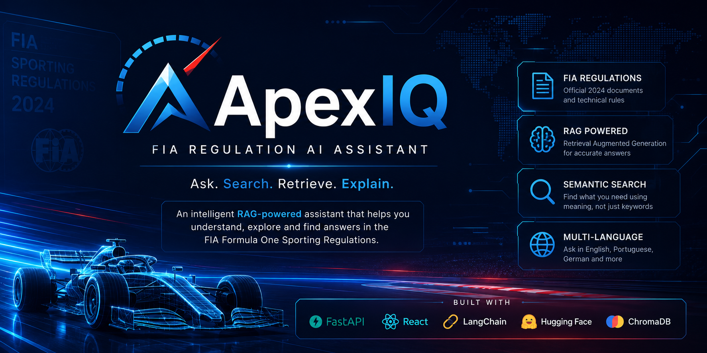
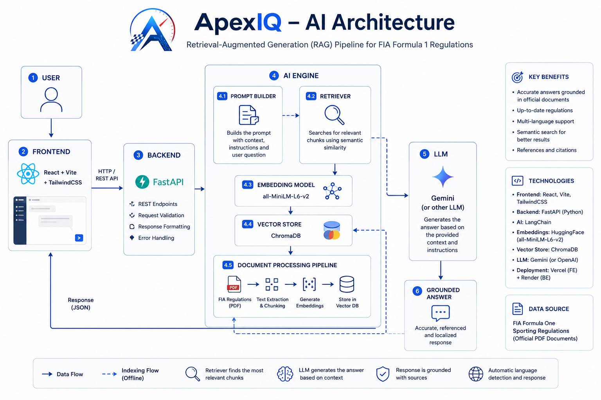
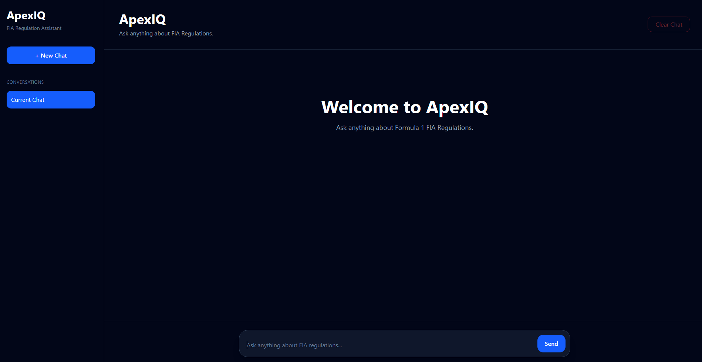
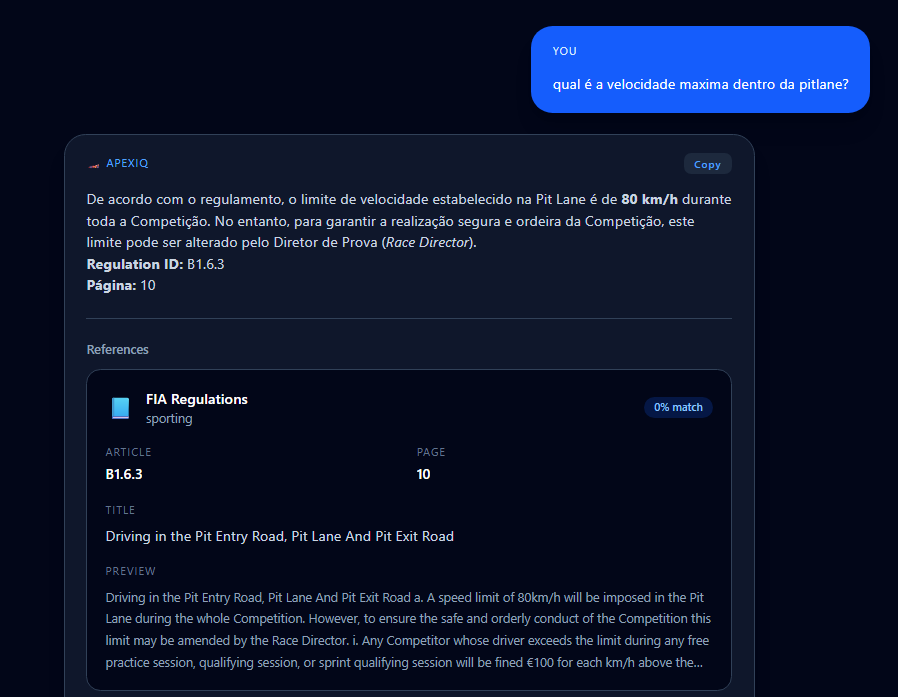

<p align="center">
  
</p>

<h1 align="center">
🏎 ApexIQ
</h1>

<p align="center">
<b>AI-powered FIA Formula One Regulations Assistant</b>
</p>

<p align="center">

An intelligent Retrieval-Augmented Generation (RAG) assistant that enables users to search, understand, and interact with the official FIA Formula One Sporting Regulations using natural language.

</p>

---

## 🌐 Live Demo

**Frontend**

➡ **https://apexiq-rust.vercel.app/** ⬅

**Backend API**

➡ **https://content-healing-production-5f7c.up.railway.app/** ⬅

---

# 🚀 Overview

ApexIQ transforms hundreds of pages of FIA Sporting Regulations into an interactive AI assistant.

Instead of manually searching PDF files, users can ask questions in natural language and instantly receive grounded answers with references to the official regulations.

The application combines modern AI techniques with semantic search to deliver accurate and explainable responses.

---

# ✨ Features

- 🧠 AI-powered assistant
- 📄 Official FIA Sporting Regulations knowledge base
- 🔍 Semantic Search (Vector Database)
- 🤖 Google Gemini integration
- 📚 Source citations
- 🌍 Automatic multilingual responses
- ⚡ Fast Retrieval-Augmented Generation (RAG)
- 💻 Modern ChatGPT-inspired interface
- 📱 Responsive UI
- ☁ Cloud deployment

---

# 🌍 Multi-language Support

ApexIQ automatically detects the user's language.

| Language | Supported |
|-----------|-----------|
| English | ✅ |
| Portuguese | ✅ |
| Spanish | ✅ |
| French | ✅ |
| German | ✅ |
| Italian | ✅ |

No manual language selection is required.

---

# 🏗 System Architecture

<p align="center">

</p>

```
User
   │
   ▼
React + Vite Frontend
   │
   ▼
FastAPI API
   │
   ▼
AI Engine
   ├── Retriever
   ├── Prompt Builder
   ├── Gemini LLM
   └── Vector Search
   │
   ▼
FAISS Index
   │
   ▼
Official FIA Sporting Regulations
```

---

# ⚙ Tech Stack

## Frontend

- React
- TypeScript
- TailwindCSS
- Vite
- Axios

## Backend

- FastAPI
- Python

## Artificial Intelligence

- Google Gemini API
- Sentence Transformers
- FAISS
- Retrieval-Augmented Generation (RAG)
- Semantic Search

## Deployment

- Vercel
- Railway

---

# 📂 Project Structure

```text
ApexIQ
│
├── apps
│   ├── backend
│   │   ├── app
│   │   │   ├── api
│   │   │   ├── models
│   │   │   ├── services
│   │   │   └── ...
│   │   ├── data
│   │   ├── main.py
│   │   └── requirements.txt
│   │
│   └── frontend
│       ├── src
│       │   ├── components
│       │   ├── pages
│       │   ├── services
│       │   └── ...
│       └── package.json
│
├── docs
│
└── README.md
```

---

# 🚀 Installation

## Clone the repository

```bash
git clone https://github.com/annagomezt/apexiq
```

⬅ ALTERAR

```bash
cd apexiq
```

---

## Backend

```bash
cd apps/backend
```

Create virtual environment

```bash
python -m venv .venv
```

Activate

Windows

```bash
.venv\Scripts\activate
```

Linux/macOS

```bash
source .venv/bin/activate
```

Install dependencies

```bash
pip install -r requirements.txt
```

Create a `.env`

```env
GEMINI_API_KEY=YOUR_API_KEY
```

Run

```bash
uvicorn main:app --reload
```

---

## Frontend

```bash
cd apps/frontend
```

Install dependencies

```bash
npm install
```

Run

```bash
npm run dev
```

---

# 🖥 Local URLs

Frontend

```
http://localhost:5173
```

Backend

```
http://127.0.0.1:8000
```

Swagger

```
http://127.0.0.1:8000/docs
```

---

# 💬 Example Questions

### English

```
What is the maximum speed allowed in the pit lane?
```

### Portuguese

```
Qual é o limite de velocidade no pit lane?
```

### Spanish

```
¿Cuál es el límite de velocidad en el pit lane?
```

### German

```
Wie hoch ist das Tempolimit in der Boxengasse?
```

---

# 📸 Screenshots

## Home



---

## Chat



---

# 📚 Knowledge Base

The assistant is built upon the official FIA Formula One Sporting Regulations.

Processing pipeline:

- PDF Extraction
- Text Chunking
- Embedding Generation
- FAISS Indexing
- Semantic Retrieval
- Prompt Construction
- Gemini Response Generation

Only the retrieved document chunks are sent to the language model, reducing hallucinations and improving factual accuracy.

---

# 🛣 Roadmap

- [ ] Conversation history
- [ ] Authentication
- [ ] User accounts
- [ ] Multiple FIA regulation versions
- [ ] FIA Technical Regulations
- [ ] FIA Financial Regulations
- [ ] Streaming responses
- [ ] Voice assistant
- [ ] Mobile version
- [ ] Dark/Light themes

---

# 👩‍💻 Author

**Ana Beatriz Gomes Santos**

Software Engineering Student

GitHub

➡ https://github.com/annagomezt ⬅ 

LinkedIn

➡ https://www.linkedin.com/in/anagomes-swe/ ⬅

---

# 📄 License

This project was developed for educational purposes as part of the **Oracle Next Education (ONE)** AI Challenge.

All FIA documents remain the intellectual property of the Fédération Internationale de l'Automobile (FIA).

---

<p align="center">

Made with ❤️ using FastAPI, React, Python and Artificial Intelligence.

</p>